# Simple Docker

Введение в докер. Разработка простого докер-образа для собственного сервера.

## Part 1. Готовый докер

**== Решение ==**

##### Возьмем официальный докер-образ с **nginx** и выкачаем его при помощи `docker pull`.
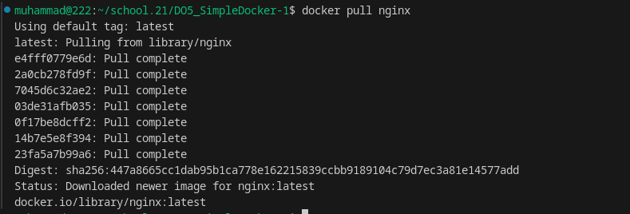

##### Проверим наличие докер-образа через `docker images`.
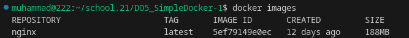

##### Запустим докер-образ через `docker run -d [image_id|repository]`.
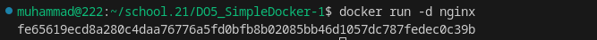

##### Проверим, что образ запустился через `docker ps`.
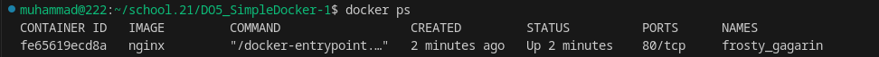

##### Посмотрим информацию о контейнере через `docker inspect [container_id|container_name]`.
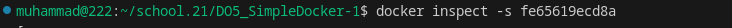
##### По выводу команды определим и поместим в отчёт размер контейнера:
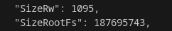

#### Список замапленных портов:

#### и ip контейнера:

##### Остановим докер контейнер через `docker stop [container_id|container_name]`.
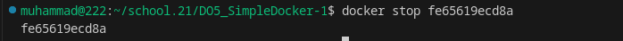

##### Проверим, что контейнер остановился через `docker ps`.
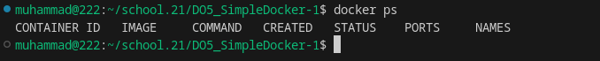

##### Запустим докер с портами 80 и 443 в контейнере, замапленными на такие же порты на локальной машине, через команду *run*.
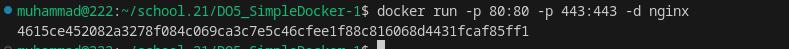

##### Проверим, что в браузере по адресу *localhost:80* доступна стартовая страница **nginx**.
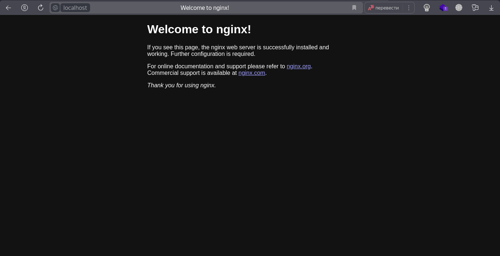

##### Перезапустим докер контейнер через `docker restart [container_id|container_name]`.
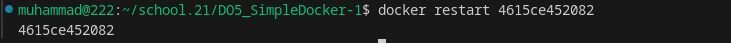

##### Проверим любым способом, что контейнер запустился.
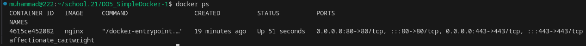

#### Проверим стартовой страницы **nginx** по адресу *localhost:80* после перезапуска.
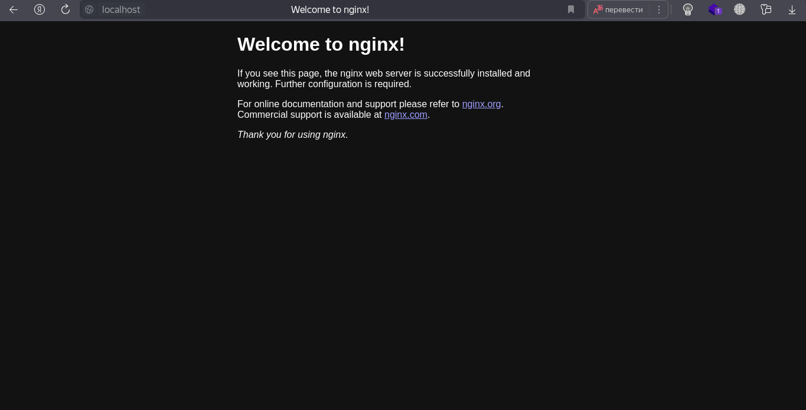

## Part 2. Операции с контейнером

Докер-образ и контейнер готовы. Теперь можно покопаться в конфигурации **nginx** и отобразить статус страницы.

**== Решение ==**

##### Прочитаем конфигурационный файл *nginx.conf* внутри докер контейнера через команду *exec*:
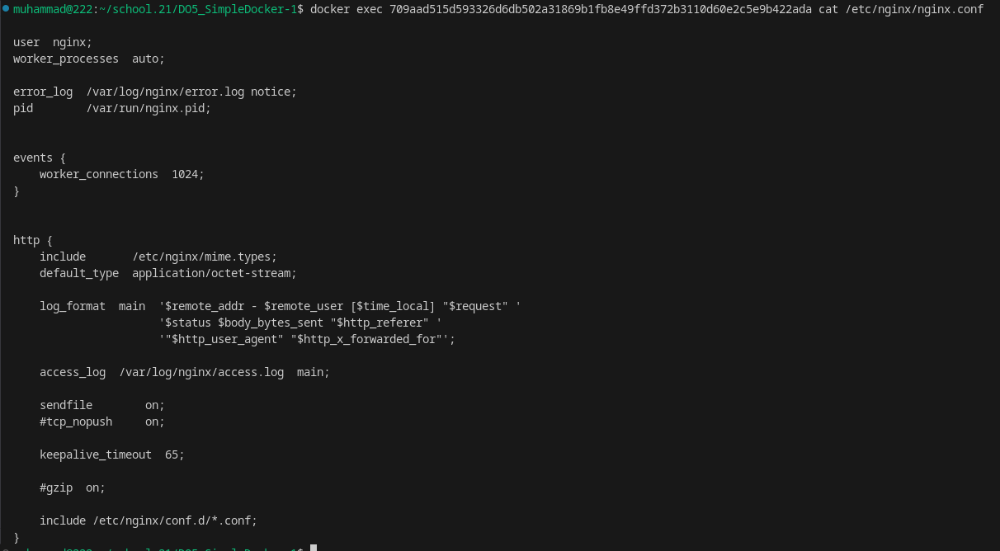

##### Создадим на локальной машине файл *nginx.conf* с данными из конфигурационного файла *nginx.conf* и откроем для редактирования через *vim*:
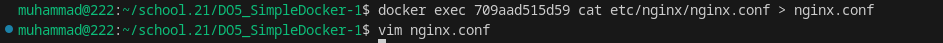

##### Настроем в нем по пути */status* отдачу страницы статуса сервера **nginx**.
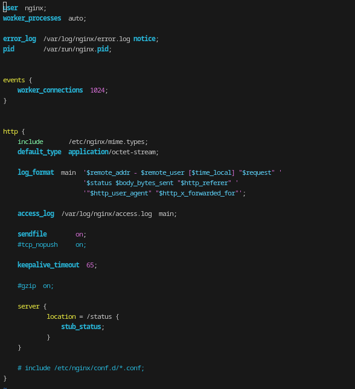

##### Скопируем созданный файл *nginx.conf* внутрь докер-образа через команду `docker cp`.

##### Перезапустим **nginx** внутри докер-образа через команду *exec*.
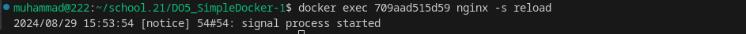

##### Проверим, что по адресу *localhost:80/status* отдается страничка со статусом сервера **nginx**.
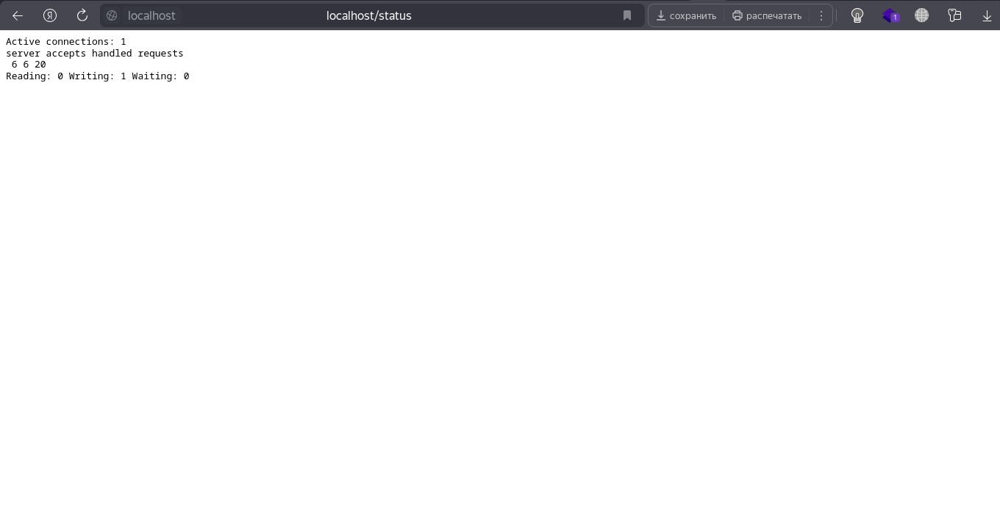

##### Экспортируем контейнер в файл *container.tar* через команду *export*.

##### Остановим контейнер.
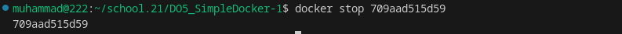

##### Удалим образ через `docker rmi [image_id|repository]`, не удаляя перед этим контейнеры.
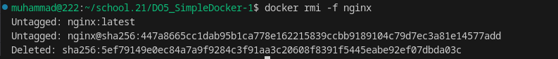

##### Удалим остановленный контейнер.
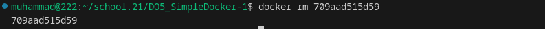

##### Импортируем контейнер обратно через команду *import*.
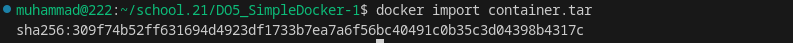

##### Запустим импортированный контейнер.
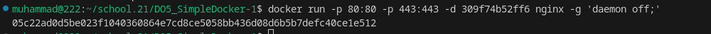

##### Проверим, что по адресу *localhost:80/status* отдается страничка со статусом сервера **nginx**.
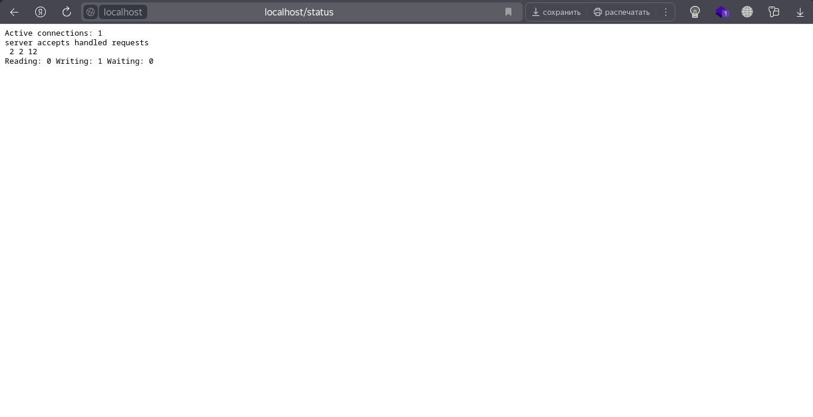

## Part 3. Мини веб-сервер

Теперь стоит немного оторваться от докера, чтобы подготовиться к последнему этапу. Время написать свой сервер.

**== Решение ==**

##### Напишим мини-сервер на **C** и **FastCgi**, который будет возвращать простейшую страничку с надписью `Hello World!`.
#### Сначало скачаем `nginx` командой `docker pull nginx`
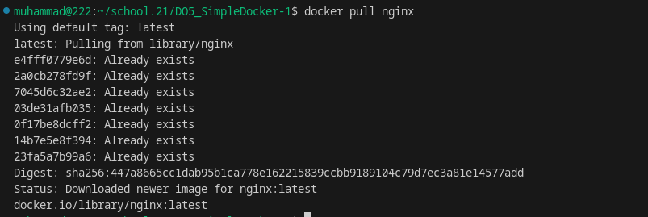

#### Запустим контейнер командой `docker run --rm -d -p 81:81 [container_id|container_name] nginx`
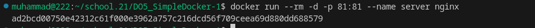

#### Проверим систему на наличие обновлений командой `docker exec [container_id|container_name] apt update`
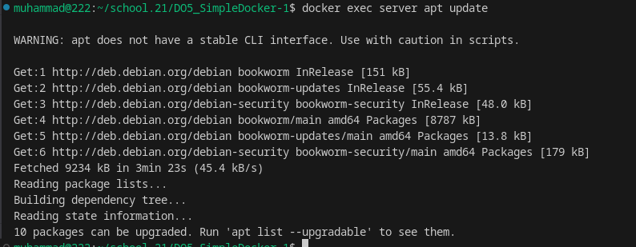

#### Командой `docker exec [container_id|container_name] apt install -y gcc spawn-fcgi libfcgi-dev` установим необходимые инструменты для компиляции сервера.
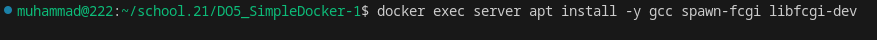

#### Командой `docker commit [container_id|container_name] [new image]` зафиксируем изменения.
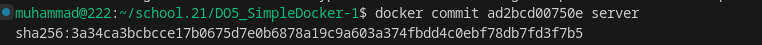

#### Напишим свой *nginx.conf*, который будет проксировать все запросы с 81 порта на *127.0.0.1:8080*.
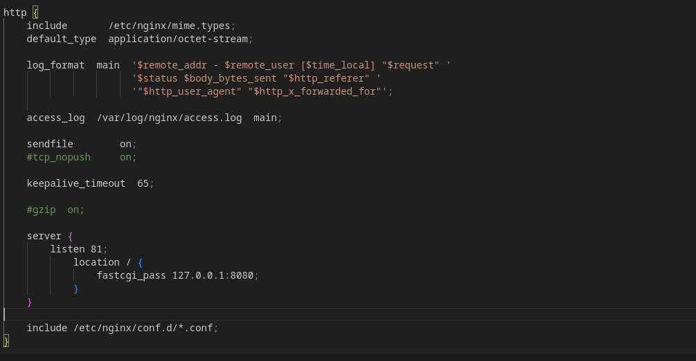

#### Командой `docker cp nginx.conf [container_id|container_name]:/etc/nginx/nginx.conf` внесем изменения в конфиругационный файл nginx
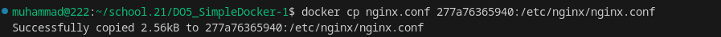

##### Запустим написанный мини-сервер через *spawn-fcgi* на порту 8080.
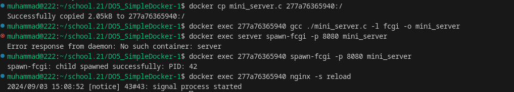

##### Проверим, что в браузере по *localhost:81* отдается написанная нами страничка.

## Part 4. Свой докер

Теперь всё готово. Можно приступать к написанию докер-образа для созданного сервера.

**== Решение ==**

#### Напишим свой докер-образ, который:
##### 1) собирает исходники мини сервера на FastCgi из [Части 3](#part-3-мини-веб-сервер);
##### 2) запускает его на 8080 порту;
##### 3) копирует внутрь образа написанный *./nginx/nginx.conf*;
##### 4) запускает **nginx**.
_**nginx** можно установить внутрь докера самостоятельно, а можно воспользоваться готовым образом с **nginx**'ом, как базовым._
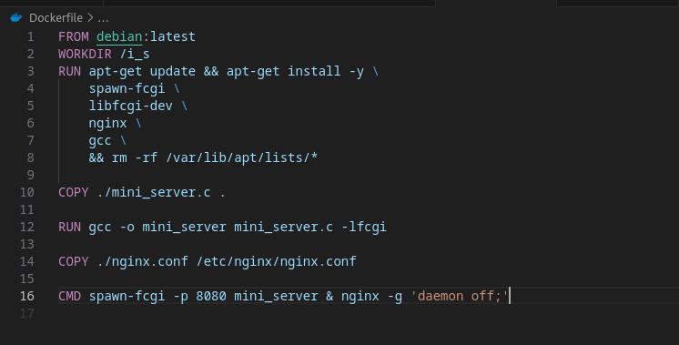

#### Соберем написанный докер-образ через `docker build` при этом указав имя и тег.
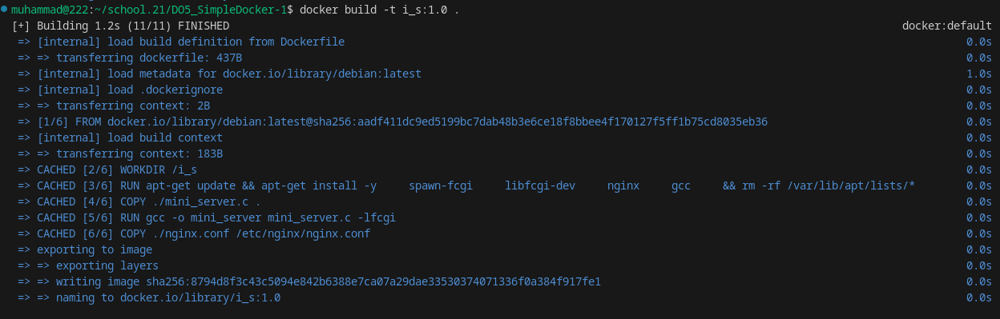

#### Проверим через `docker images`, что все собралось корректно.
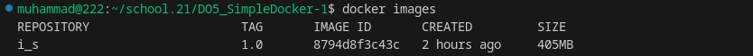

#### Запустим собранный докер-образ с маппингом 81 порта на 80 на локальной машине и маппингом папки *./nginx* внутрь контейнера по адресу, где лежат конфигурационные файлы **nginx**'а (см. [Часть 2](#part-2-операции-с-контейнером)).
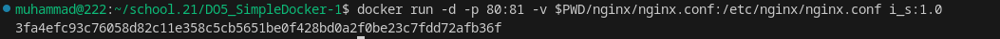

#### Проверим, что по localhost:80 доступна страничка написанного мини сервера.
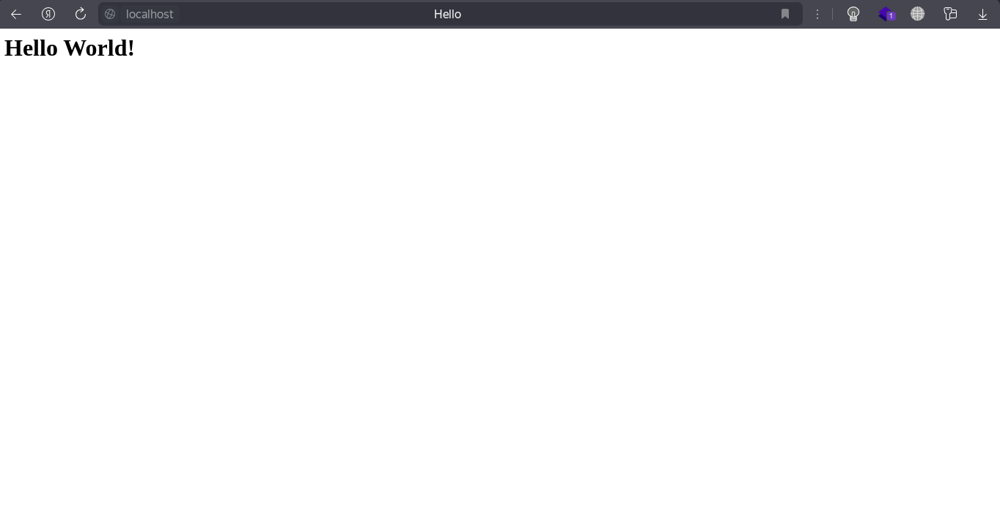

#### Допишим в *./nginx/nginx.conf* проксирование странички */status*, по которой будем отдавать статус сервера **nginx**.
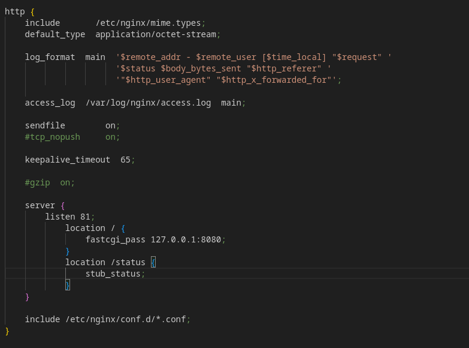

#### Перезапустим докер-образ.
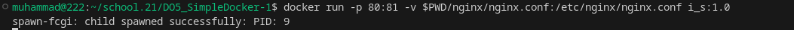

#### Проверим, что теперь по *localhost:80/status* отдается страничка со статусом **nginx**

## Part 5. **Dockle**

После написания образа никогда не будет лишним проверить его на безопасность.

**== Решение ==**

##### Просканируем образ из предыдущего задания через `dockle [image_id|repository]`.
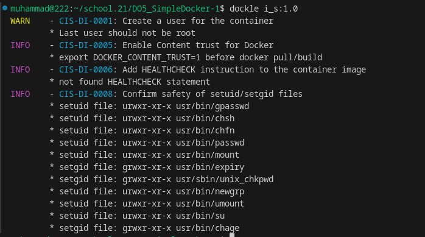

##### Исправим образ так, чтобы при проверке через **dockle** не было ошибок и предупреждений.
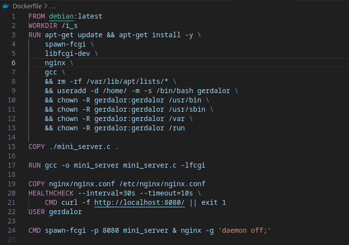

##### Запустим команду `export DOCKER_CONTENT_TRUST=1` и пересоберем образ:
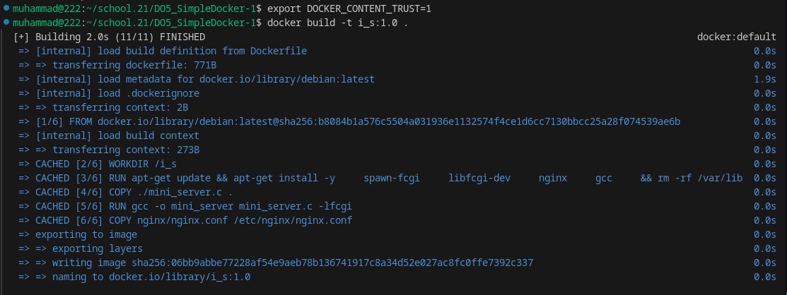

##### Проверим что ошибок и предубреждений нет:
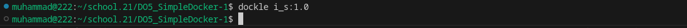

## Part 6. Базовый **Docker Compose**

Вот ты и закончил свою разминку. А хотя погоди...
Почему бы не поэкспериментировать с развёртыванием проекта, состоящего сразу из нескольких докер-образов?

**== Решение ==**

##### Напишим файл *docker-compose.yml*, с помощью которого:
##### 1) Поднимим докер-контейнер из [Части 5](#part-5-инструмент-dockle) _(он должен работать в локальной сети, т. е. не нужно использовать инструкцию **EXPOSE** и мапить порты на локальную машину)_.
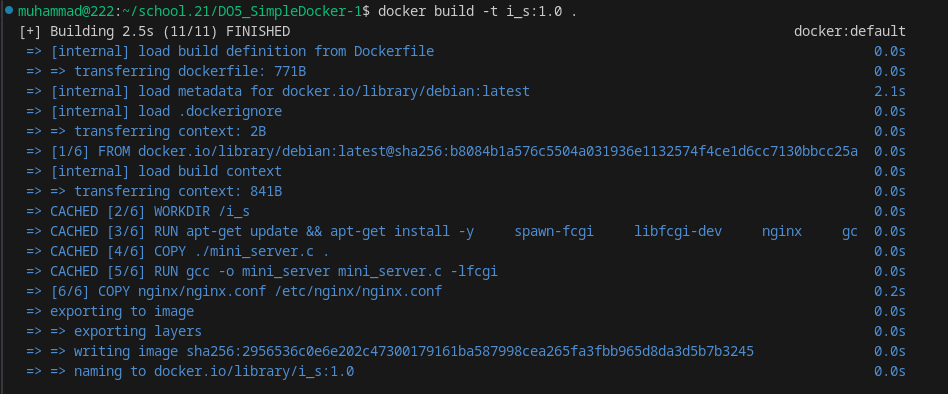
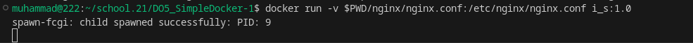

##### 2) Поднимим докер-контейнер с **nginx**, который будет проксировать все запросы с 8080 порта на 81 порт первого контейнера.
##### Замапим 8080 порт второго контейнера на 80 порт локальной машины.
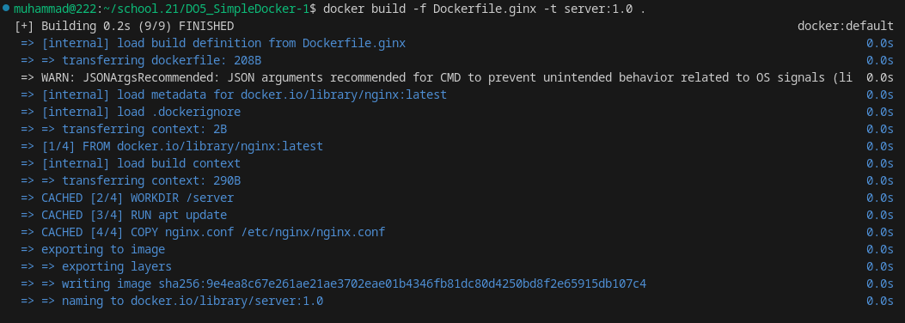
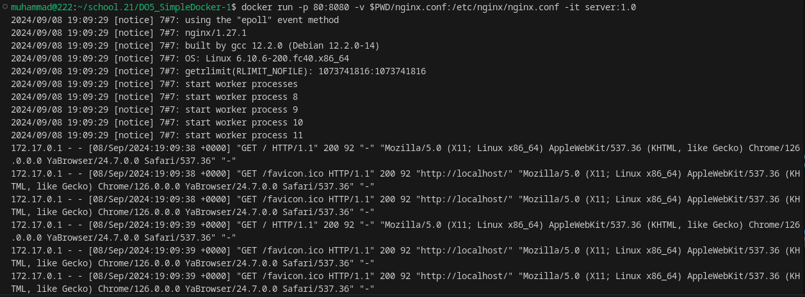

##### Nginx для первого контейнера
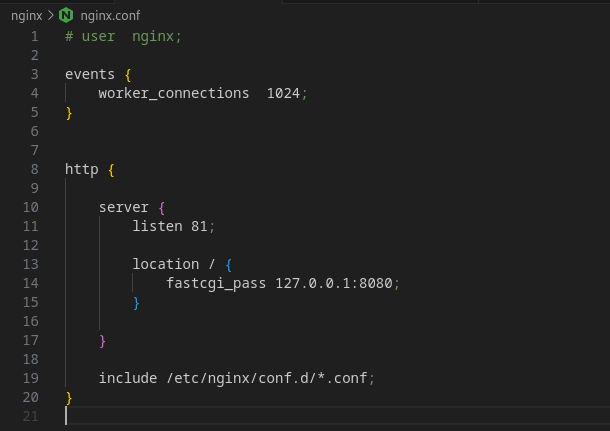

##### Nginx для второго контейнера
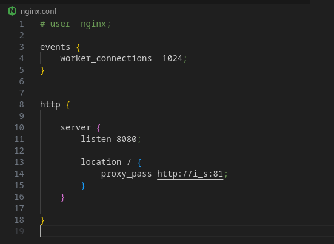

##### Dockerfile для первого контейнера
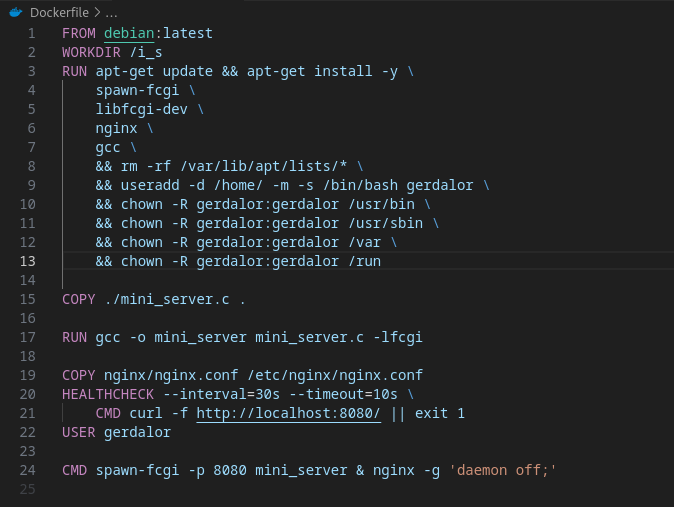

##### Dockerfile для второго контейнера

##### Docker-compose

##### Остановим все запущенные контейнеры.

##### Соберем и запустим проект с помощью команд `docker-compose build`

##### и `docker-compose up`.

##### Проверим, что в браузере по *localhost:80* отдается написанная нами страничка, как и ранее.

